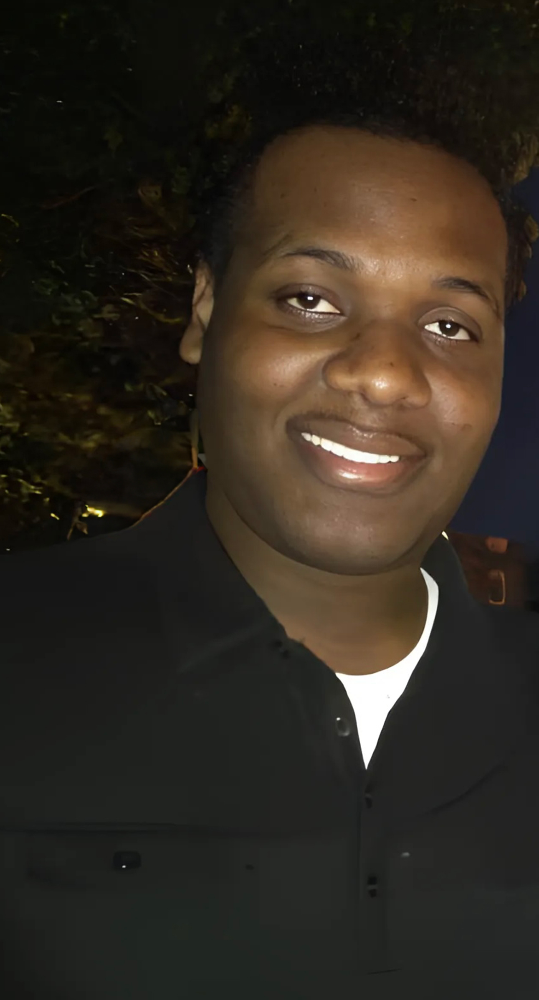

# **Oshane O. Thomas, PhD**  
Seattle, WA | [LinkedIn](https://www.linkedin.com/in/oshane-o-thomas) | [GitHub](https://github.com/oothomas)  

    
    

        I am a computational biologist and machine learning researcher specializing in biological shape analysis, AI-powered phenotyping, and functional morphology.  
        My expertise bridges academic research and industry applications, leveraging deep learning and 3D data processing to extract meaningful insights from morphological datasets.  
    

---

## **🛠️ Expertise & Skills**  

**AI & Computational Morphology:** Deep learning for biological shape analysis, automated landmarking, and morphospace visualization.

**3D Data Processing & Visualization:** Advanced geometric morphometrics, micro-CT data segmentation, functional shape analysis.

**Machine Learning & AI:** Transformer-based classification, generative AI, functional map-based shape matching.

**Software Development & Tooling:** Developer of **3D Slicer extensions** and open-source tools for biological and medical imaging research.

**Interdisciplinary Research & Leadership:** Experience collaborating across **biomechanics, evolutionary biology, and AI** to develop cutting-edge solutions.  

---

## **📄 Career Highlights**  

🔹 **Postdoctoral Fellow, Seattle Children's Research Institute**  
   - Developing AI-driven **morphometric analysis tools** to study biological shape variation.  
   - Creating **automated pipelines for 3D shape processing** in biomedical imaging.  
   - Leading **SlicerMorph training sessions** to advance the adoption of computational shape analysis.  

🔹 **Research in AI & Shape Analysis**  
   - **Published in PLOS Computational Biology & Journal of Anatomy.**  
   - Developed **novel deep learning frameworks** for shape-based phenotyping.  
   - Applied **functional map-based methods** to automate biological morphology studies.  

🔹 **Machine Learning & Data Science**  
   - **Developed Explainable GaitViT**, a Transformer-based gait classification model.  
   - Created **morphVQ**, an AI pipeline for automated shape matching.  
   - Built **micro-CT segmentation models** for biomedical research.  

---

## **🚀 Featured Work**  
**Explore my projects, research, and open-source contributions:**  

    <a href="/projects.md" style="
        background-color: #007BFF;
        color: white;
        padding: 12px 20px;
        border-radius: 8px;
        font-size: 18px;
        font-weight: bold;
        text-decoration: none;
        display: inline-block;
        margin: 10px;">
        🔗 View My Projects
    </a>

---

## **📩 Get in Touch**
📧 [oothomas07@gmail.com](mailto:oothomas07@gmail.com)  
🔗 Connect on **[LinkedIn](https://www.linkedin.com/in/oshane-o-thomas)**  
📂 Explore my **[Publications](publications/)** and **[Tools](tools/)**  

---